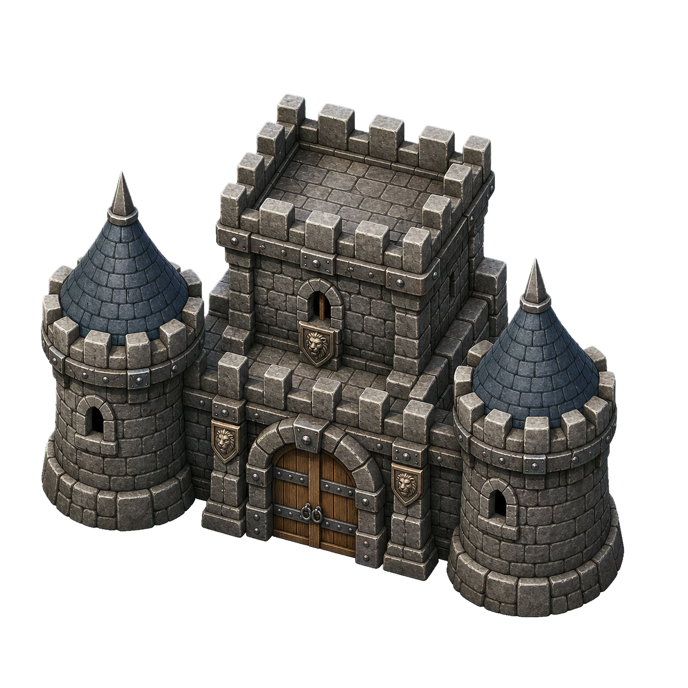
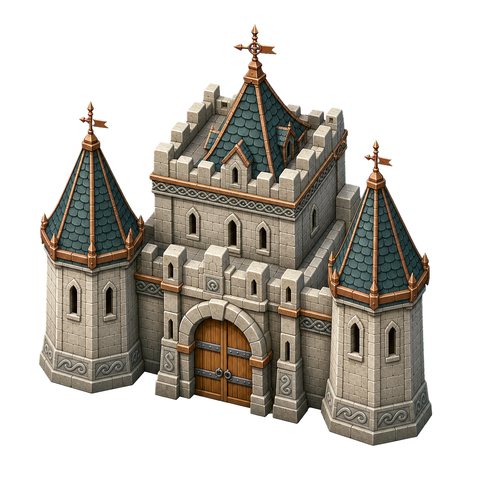
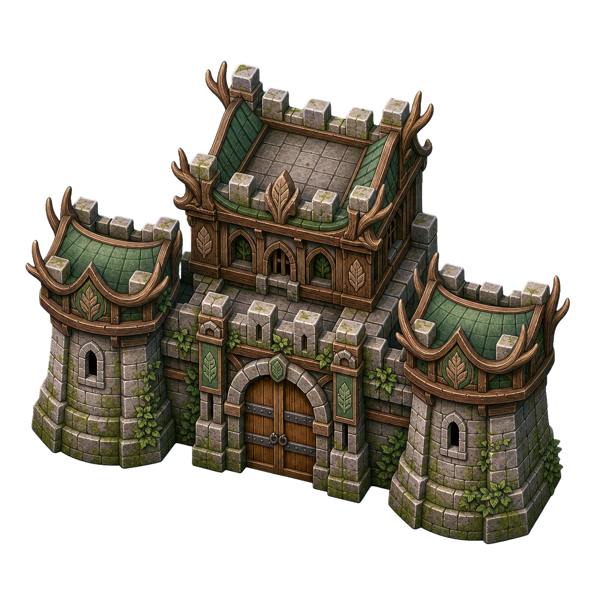

<p align="center">
  
</p>

<h1 align="center">Quadrant Wars</h1>

<p align="center">
  <strong>Game chiến thuật thời gian thực về chinh phục lãnh thổ, xây dựng vương quốc và giao tranh trên bản đồ động.</strong>
</p>

<p align="center">
  
  
  
  
</p>

<p align="center">
  <a href="#thong-tin-do-an">Thông tin đồ án</a>
  &nbsp;|&nbsp;
  <a href="#tong-quan">Tổng quan</a>
  &nbsp;|&nbsp;
  <a href="#cai-dat-va-chay">Cài đặt</a>
  &nbsp;|&nbsp;
  <a href="#dieu-khien">Điều khiển</a>
  &nbsp;|&nbsp;
  <a href="#cam-nang-va-vong-doi">Cẩm nang</a>
  &nbsp;|&nbsp;
  <a href="#cau-truc-du-an">Kiến trúc</a>
</p>

---

<h2 id="thong-tin-do-an">Thông tin đồ án</h2>

| Hạng mục | Chi tiết |
| --- | --- |
| Môn học | IT002 - Lập trình hướng đối tượng |
| Lớp | TTNT2025 |
| Giảng viên | Phạm Nguyễn Trường An |
| Loại dự án | Đồ án nhóm |
| Ngôn ngữ | Python 3.10+ |
| Framework | Pygame 2.5+ |

### Thành viên nhóm

| Thành viên | MSSV |
| --- | --- |
| Nguyễn Minh Khang | 25520793 |
| Phạm Thành Trung | 25521970 |
| Nguyễn Cao Nguyên | 25521241 |

---

<h2 id="tong-quan">Tổng quan game</h2>

**Quadrant Wars** là game chiến thuật thời gian thực dành cho 2-4 người chơi hoặc bot trên chiến trường 1280x720 có thể co giãn theo cửa sổ. Mỗi lãnh thổ có vàng, Worker, Soldier, Queen, hàng chờ tuyển quân và công trình chuyên môn hóa riêng; mỗi phe bắt đầu với một Soldier phòng thủ.

Mỗi phe khởi đầu với một thủ đô. Người chơi tuyển quân, phát triển từng vùng, tấn công đối thủ, tranh mục tiêu trung lập và tiêu diệt Queen của các phe còn lại để trở thành vương quốc sống sót cuối cùng.

### Vòng lặp gameplay

```text
Tuyển quân -> Phát triển lãnh thổ -> Hành quân và giao tranh -> Chiếm vùng
     ^                                                        |
     +------ Nhận vàng địa phương và phần thưởng mục tiêu ----+
```

### Tính năng chính

| Tính năng | Mô tả |
| --- | --- |
| 2-4 người chơi | Mỗi slot có thể là Human hoặc một trong ba chiến thuật bot. |
| Kinh tế theo lãnh thổ | Mỗi vùng sống còn tạo `0.30` vàng/giây; mỗi Worker cộng `0.40` vàng/giây và toàn bộ tài nguyên được quản lý cục bộ. |
| Tuyển quân theo vùng | Chọn chính xác vùng sở hữu nào sẽ tuyển Soldier hoặc Worker; áp dụng cho cả bốn bộ phím điều khiển. |
| Chuyên môn hóa lãnh thổ | Economy giảm giá Worker, Barracks tăng tốc huấn luyện, Fortress triển khai Vệ binh. |
| Mục tiêu trung lập | Tranh Caravan, War Banner và Ancient Shrine để đảo chiều nhịp độ trận đấu. |
| Hành quân A* | Đạo quân tìm tuyến ngắn quanh lâu đài, công trình và vùng sông; không dùng đường chỉ dẫn nhân tạo. |
| Combat FFA thời gian thực | Mỗi Soldier giữ HP, vị trí, mục tiêu, cooldown và animation riêng; 2-4 phe có thể nhập cùng một chiến trường và tiếp viện tức thời. |
| Bot khác biệt | Aggressive, Balanced và Economic Bot có ưu tiên phát triển và chiến đấu khác nhau. |
| Cẩm nang động | Năm trang tiếng Việt có sa bàn animation, số liệu lấy trực tiếp từ cấu hình cân bằng. |
| Vòng đời hoàn chỉnh | Intro 3-2-1, pause làm mờ, đếm ngược tiếp tục, xác nhận rời trận và màn kết quả chi tiết. |
| Đồ họa và âm thanh | Sông chảy, biên giới hữu cơ, bốn lâu đài văn hóa, sprite chuyển động, VFX và âm thanh sự kiện. |

### Bốn nền văn hóa

<table>
  <tr>
    <td align="center"><br><strong>Western Highland</strong></td>
    <td align="center"><br><strong>Northern River</strong></td>
    <td align="center"><br><strong>Forest Realm</strong></td>
    <td align="center"><br><strong>Sun Court</strong></td>
  </tr>
</table>

---

## Chuyên môn hóa lãnh thổ

Mỗi lãnh thổ có thể được phát triển độc lập. Toàn bộ chi phí lấy từ vàng cục bộ của vùng đang nâng cấp.

| Nhánh | Cấp I | Cấp II |
| --- | --- | --- |
| Economy | Worker tạo thêm 15% vàng; Worker mới rẻ hơn 8%. | Worker tạo thêm 30% vàng; Worker mới rẻ hơn 16%. |
| Barracks | Soldier giá 12 vàng; huấn luyện trong 1.04 giây. | Soldier giá 10 vàng; huấn luyện trong 0.78 giây. |
| Fortress | 2 Vệ binh; toàn bộ phòng thủ giảm 6% sát thương nhận vào. | 4 Vệ binh; toàn bộ phòng thủ giảm 12% sát thương nhận vào. |

- Xây cấp I tốn `30` vàng cục bộ.
- Nâng cấp II tốn `55` vàng cục bộ.
- Đổi sang nhánh khác tốn `40` vàng và quay lại cấp I.
- Khi bị chiếm, công trình mất một cấp. Công trình cấp I trở thành phế tích để chủ mới có thể sửa lại.

Vùng không có Worker vẫn tự tạo `0.30` vàng/giây. Economy chỉ nhân phần thu nhập do Worker tạo ra, không nhân khoản cơ bản. Worker thứ hai có giá thường khoảng `29` vàng, còn `26` vàng ở Economy I và `24` vàng ở Economy II; Worker đã nằm trong hàng chờ không được hoàn chênh lệch.

Mỗi Vệ binh có `18 HP`, gây `3 damage` với tốc độ `0.8` đòn/giây và chỉ hoạt động trong phạm vi phòng thủ quanh lâu đài. Vệ binh hồi `1 HP/giây` ngoài giao tranh; ô trống hồi sinh sau `45` giây và bộ đếm dừng khi lãnh thổ lại bị tấn công. Đổi khỏi Fortress xóa đội Vệ binh, còn Fortress bị chiếm sẽ giảm một cấp như các nhánh khác.

---

## Mục tiêu trung lập

Mục tiêu được cảnh báo trước khi xuất hiện, có lính gác trung lập và một lõi HP dùng chung. Mọi phe đều có thể đưa quân đến tranh chấp.

| Mục tiêu | Phần thưởng |
| --- | --- |
| Caravan | Cộng `30` vàng vào thủ đô hiện tại. |
| War Banner | Tăng 18% sát thương và tốc độ hành quân trong 30 giây. |
| Ancient Shrine | Hồi 28 HP cho toàn bộ Queen còn sống, không vượt quá máu tối đa. |

Mục tiêu có 4 lính gác và lõi 30 HP. Đợt đầu được cảnh báo ở giây 110 và kích hoạt ở giây 120. Mục tiêu tồn tại cho đến khi bị chiếm; sau đó chu kỳ tiếp theo chờ 120 giây và luôn cảnh báo trước 10 giây.

Nếu nhiều phe cùng tranh mục tiêu, lính gác trung lập rút ra ngoài và giữ nguyên HP. Các Player đánh FFA trước; phe cuối cùng tiếp tục đánh lính gác và lõi bằng lượng HP còn lại, không được hồi miễn phí. Tại lãnh thổ, quân phòng thủ và mọi phe tấn công cũng dùng cùng luật FFA; Worker trú ẩn và HP của Worker trở thành lớp khiên trước lõi Queen.

---

<h2 id="cai-dat-va-chay">Cài đặt và chạy</h2>

### 1. Clone repository

```powershell
git clone https://github.com/POG42069/OOP_Nguyen_Trung_Khang.git
cd OOP_Nguyen_Trung_Khang
```

### 2. Tạo và kích hoạt môi trường ảo

```powershell
python -m venv .venv
.\.venv\Scripts\Activate.ps1
```

### 3. Cài thư viện

```powershell
pip install -r requirements.txt
```

### 4. Chạy game

```powershell
python -m quadrant_wars.main
```

Có thể chạy trực tiếp bằng `python quadrant_wars\main.py` từ thư mục gốc của repository.

---

<h2 id="dieu-khien">Điều khiển</h2>

Trong menu khởi đầu, đặt slot người chơi thành `Human` để bật bộ phím tương ứng.

| Player | Phím 1 | Phím 2 | Phím 3 |
| --- | --- | --- | --- |
| Player 1 | `Q` | `W` | `E` |
| Player 2 | `I` | `O` | `P` |
| Player 3 | `Z` | `X` | `C` |
| Player 4 | `B` | `N` | `M` |

| Trạng thái | Phím 1 | Phím 2 | Phím 3 |
| --- | --- | --- | --- |
| Bình thường | Mở Recruit | Chọn mục tiêu tấn công | Mở Strategy |
| Recruit | Chuyển vùng sở hữu | Soldier -> Worker -> Cancel | Xác nhận lựa chọn |
| Chọn mục tiêu | Chọn mục tiêu | Chọn mục tiêu | Chọn mục tiêu hoặc hủy khi có thể |
| Chọn quân tấn công | Hủy với 0% | Gửi 33% | Gửi 66% |
| Strategy | Mở Development | Tranh mục tiêu trung lập đang hoạt động | Hủy |
| Development | Chuyển vùng sở hữu | Economy -> Barracks -> Fortress -> Cancel | Xác nhận lựa chọn |

Popup Recruit hiển thị vùng đang chọn, vàng cục bộ và chi phí trước khi xác nhận tuyển quân.
Lệnh 33%/66% áp dụng trên từng vùng sở hữu có quân và luôn giữ lại ít nhất một Soldier phòng thủ.

<h2 id="cam-nang-va-vong-doi">Cẩm nang và vòng đời trận đấu</h2>

Nút **CẨM NANG** có ở Menu chính và màn Pause. Năm mục hướng dẫn bao phủ luật chơi, đơn vị, ba nhánh phát triển, mục tiêu trung lập và toàn bộ phím điều khiển. Mỗi trang có sa bàn tự chạy; có thể chuyển trang bằng chuột hoặc phím trái/phải, cuộn bằng con lăn và quay lại bằng `Esc`. Khi mở từ Pause, trận đấu giữ nguyên hoàn toàn.

Luồng màn hình được thống nhất thành:

```text
Menu -> Giới thiệu trận 3-2-1 -> Chơi -> Pause -> Tiếp tục 3-2-1
                                  |                    |
                                  +-> Kết quả <- Game Over
```

- Intro, Pause, Cẩm nang và Resume Countdown đều đóng băng thời gian Match.
- `Chơi lại` trong Pause giữ nguyên seed/map; `Đấu lại` sau Game Over tạo seed/map mới nhưng giữ đúng cấu hình Human/Bot.
- Màn kết quả hiển thị người thắng, thời lượng, lãnh thổ, Soldier, Worker và số mục tiêu đã chiếm; phím bất kỳ không còn vô tình thoát màn này.

---

## Thiết kế hướng đối tượng

| Nguyên tắc hoặc pattern | Cách áp dụng |
| --- | --- |
| Encapsulation | `Territory` quản lý tài nguyên, đơn vị, hàng chờ và công trình của chính nó. |
| Inheritance và polymorphism | `Unit` được mở rộng bởi `Queen`, `Worker`, `Soldier`, `Defender`; `Player` được mở rộng bởi `HumanPlayer`, `BotPlayer`. |
| Strategy Pattern | Các Bot Strategy xác định phong cách kinh tế, cân bằng và tấn công. |
| State Pattern | Menu, Tutorial, Intro, Playing, Pause, Resume Countdown, Transition và Game Over là các state độc lập. |
| Battle Arena | `BattleArena` mô phỏng fixed-step 30 Hz, damage đồng thời, FFA, tiếp viện, công thành và kết quả trận. |
| Pathfinding service | `BattlefieldNavigator` đóng gói A*, obstacle map, terrain cost và rút gọn waypoint. |
| Separation of concerns | Combat, quản lý trận, render, âm thanh và input được tách thành các module chuyên trách. |

---

<h2 id="cau-truc-du-an">Cấu trúc dự án</h2>

```text
OOP_Nguyen_Trung_Khang/
├── quadrant_wars/
│   ├── main.py                 # Entry point và vòng lặp Pygame
│   ├── balance_config.py       # Hằng số gameplay và cân bằng game
│   ├── core/
│   │   ├── battle_arena.py    # Fixed-step FFA và từng BattleAgent
│   │   ├── battlefield.py      # Hình học dùng chung cho sông và công trình
│   │   ├── combat.py           # Facade resolve_instant/apply_result
│   │   ├── map_generator.py    # Sinh bản đồ lãnh thổ hữu cơ
│   │   ├── navigation.py       # A* pathfinding và obstacle avoidance
│   │   ├── objective.py        # Mục tiêu trung lập
│   │   ├── player.py           # Human, bot và bot strategy
│   │   ├── territory.py        # Kinh tế, unit và specialization
│   │   └── unit.py             # Hệ thống unit
│   ├── game/
│   │   ├── game_manager.py     # Vòng đời trận, army, capture, reward
│   │   └── states.py           # State machine màn hình và input
│   ├── ui/
│   │   ├── art.py              # Load artwork và animation frame
│   │   ├── renderer.py         # Map, HUD, effect và animation
│   │   ├── sound.py            # Phát âm thanh theo sự kiện
│   │   └── tutorial.py         # Cẩm nang động và sa bàn minh họa
│   ├── assets/
│   │   ├── images/             # Bản đồ, lâu đài và artwork unit
│   │   └── sounds/             # Âm thanh tuyển quân, combat, objective
│   ├── simulation/             # Mô phỏng cân bằng headless
│   └── tests/                  # Unit test và gameplay-flow test
├── requirements.txt
└── README.md
```

---

## Kiểm thử và mô phỏng

Chạy unit test và mô phỏng cân bằng từ thư mục gốc:

```powershell
python -m unittest discover -s quadrant_wars\tests
python quadrant_wars\simulation\balance_sim.py --matches 100 --players 2 3 4
python -m quadrant_wars.simulation.combat_benchmark
```

Bộ kiểm thử bao phủ combat API, Vệ binh, FFA 2-4 phe, damage đồng thời, development, objective, input bốn người, vòng đời UI, seed tái lập, A* và cam kết vẽ đủ số Soldier. Benchmark giữ đủ 200 Soldier hoạt động ở 1280x720 và báo average, P95, max cùng số frame vượt 33 ms.

Benchmark kiểm tra bất biến đủ 200 Soldier, thời gian khung hình trung bình, P95, đỉnh và số frame vượt 33 ms. Kết quả phụ thuộc CPU/GPU, driver SDL và các tiến trình đang chạy, nên README không chép cứng một con số dễ lỗi thời. Báo cáo cân bằng cũng được tạo trực tiếp từ engine và seed hiện tại bằng lệnh phía trên sau mỗi lần điều chỉnh gameplay.

---

## Mục đích học thuật

Repository được phát triển cho đồ án nhóm môn **IT002 - Lập trình hướng đối tượng**, phục vụ mục đích học tập, trình diễn và nghiên cứu thiết kế phần mềm hướng đối tượng.
